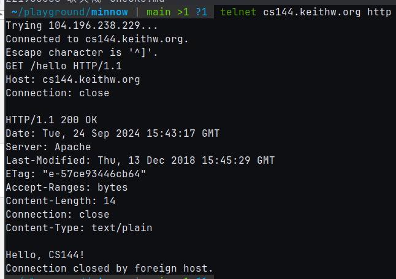
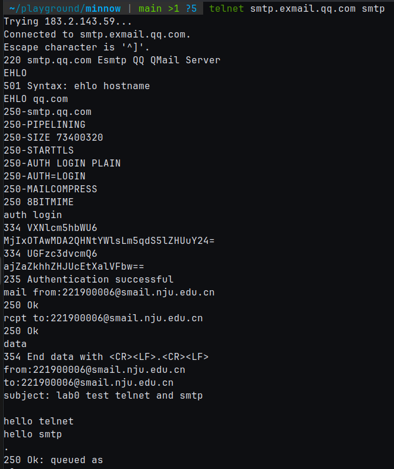
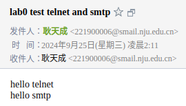
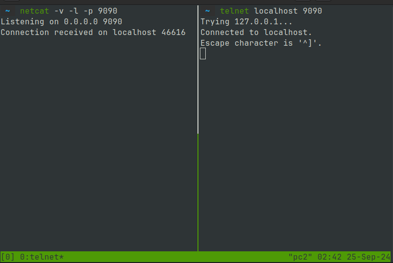
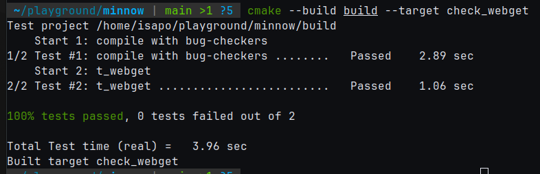
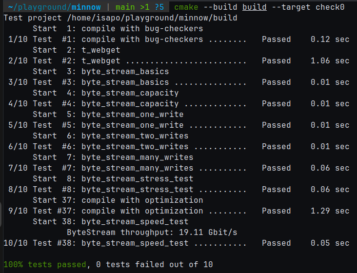

# check0 实验报告

221900006 耿天成

## 2.1 Fetch a Web Page



## 2.2 Send yourself an email



\newpage



Note: The email passcode is disabled and you cannot login through it.

\newpage

## 2.3 Listening and connecting



Hint: this is a gif, check it in markdown file.

## 3 C++ network program (ver. OS stream socket)

Code:
```cpp
 void get_URL( const string& host, const string& path )
 {
+  TCPSocket tcp;
+  tcp.connect( Address( host, "http" ) );
+  tcp.write(
+    vector<string_view>( { "GET ", path, " HTTP/1.1\r\nHost: ", host, "\r\nConnection: close\r\n\r\n" } ) );
+  while ( !tcp.eof() ) {
+    string buffer;
+    tcp.read( buffer );
+    cout << buffer;
+  }
 }
```

Result:



## 4 byte stream

Result:



\newpage

Wow, 19Gbps. Super fast, right?

I use `queue` of `string` storing the data, and one `string_view` (an reference to `data.front()`)
to accelerate peek and pop.

## Environment

```sh
lscpu | grep "Model name" | sort -u
Model name: AMD Ryzen 5 7500F 6-Core Processor
sudo dmidecode -t memory | grep Speed
        Speed: 4800 MT/s
        Configured Memory Speed: 6000 MT/s
        Speed: 4800 MT/s
        Configured Memory Speed: 6000 MT/s
cat /etc/issue
Ubuntu 24.04.1 LTS \n \l
cat /proc/version
Linux version 6.8.0-45-generic (buildd@lcy02-amd64-115) (x86_64-linux-gnu-gcc-13
(Ubuntu 13.2.0-23ubuntu4) 13.2.0, GNU ld (GNU Binutils for Ubuntu) 2.42) #45-Ubuntu
SMP PREEMPT_DYNAMIC Fri Aug 30 12:02:04 UTC 2024
```
