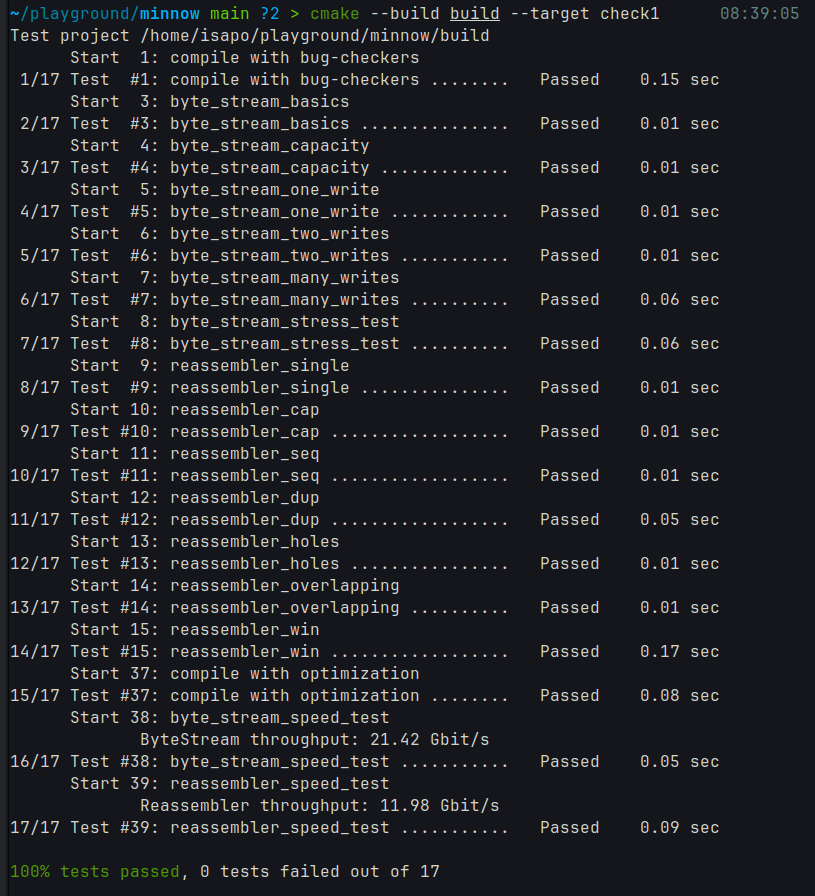

Checkpoint 1 Writeup
====================

My name: 耿天成

My SUNet ID: 221900006

I was surprised by or edified to learn that: string.substr(pos, count)

Describe Reassembler structure and design.

Describe data structures and approach taken.

用 `std::map<uint64_t, std::string> mdata` 保存 reassembler 的数据. 不变量:

1. `bytes_pending() < availiable_capacity()`

2. `bytes_pending() = mdata` 中所有 `string` 的长度之和.

3. 若 `&[i, is]` 和 `&[j, js]` 是 `mdata` 中相邻迭代器, 则 `i + is.size() <= j`.

4. 若 `mdata` 非空, `bytes_pushed() < mdata.begin()->first`.

5. 由 3, `mdata` 可导出一个维护的区间 $I$, 和函数 $m: I\to\left<chars\right>$.
   则 $m(i)=c$ 当且仅当存在某次 `insert(fi, data, ...)` 满足 `i >= bytes_pushed()`
   $\land$ `data[i - fi] = c`.

6. `bytes_pushed() == N` $\to$ `is_closed()`. N 是最后一块数据的末尾下标.

核心是维护 (3), 即维持 `mdata` 中字符串不交叉. 需要

1. 删除被 `data` 覆盖的字符串,

2. 插入 `data` 截断至 [prev.right, next.left).

(6) 的 corner case. `bytes_pushed()`改变和`N`知晓后都需要检查关闭流条件.

 

Describe alternative designs considered or tested.

考虑了优先队列, 这样会重复存储字符串; 看到网上有类似插入排序的方案, 效率差不多.

Describe benefits and weaknesses of your design compared with
alternatives -- perhaps in terms of simplicity/complexity, risk of
bugs, asymptotic performance, empirical performance, required
implementation time and difficulty, and other factors. Include any
measurements if applicable. 暂无.

Implementation Challenges: 正确性.

Remaining Bugs: 未知.

